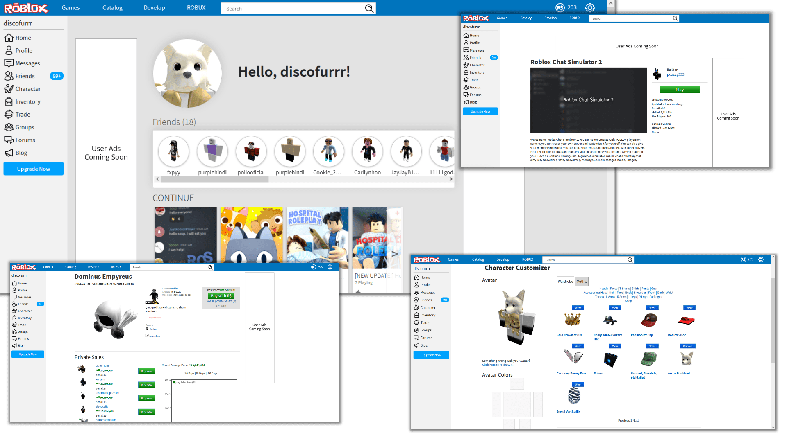

# 2016 Roblox

This is a recreation of Roblox's frontend from 2016, created with React (nextjs) and JSS. The only assets directly copied from Roblox are the logos and icons (for authenticity), as well as colors. This site is fully compatible with modern Roblox APIs.

[Get Started](docs/get-started.md) | [Project Structure](docs/dev/structure.md)

## Notes

- The exact date this is replicating is March 2016, however, images of some pages from that exact time may be hard to find, so pages based on anything 2015-2016 is fine if there are no other options.

- Although this is designed to be responsive, responsiveness is more of an afterthought (since most pages weren't responsive to begin with), so for the best experience, use a computer with a resolution of 1280x768 or higher.

- All links will cause a full page refresh. Again, this is for authenticity, however, there is no technical reason why this can't be a regular SPA.

- Components starting with "old" are not deprecated or anything, they are just components that are in an older style (e.g. 2012 Roblox) - this is because, even nowadays, roblox has many components that were created years ago, and have a distinct older style (such as the tabs on the Create page).

---

## Progress

There are some duplicates here, like the 2015+ and before 2015 profile page. I intend to do both eventually, and have them toggleable through the config file.

**Misc**

- :x: `/` Unauthenticated Homepage
- ✔️ `/home` Authenticated Homepage
- ✔️ `/my/character.aspx` Avatar customization page
   - Some rules are a bit messed up, so you can wear more than one shirt, however, this will fail once you click the update button.

**Authentication** 

- ✔️ Login Modal
- :x: Login Page
- :x: Reset Password Page
- :x: Locked account page
- :x: `/my/account` Settings Page (2016)
  - TODO:
    - Finish account info tab
    - Finish Privacy tab
    - Add Social tab
    - Add Billing tab
- :x: `/my/account` Settings Page (Before 2016)

**Users**

- ✔️ `/users/{userId}/profile` Late 2015+ Profile Page
  - TODO:
    - Add player badges
    - Add created models and clothing to Creations tab
- :x: `/User.aspx?ID=1` Before 2015 Profile Page
- ✔️ `/messages/compose` Message compose page
  - This is likely not accurate. I could not find any images of the message compose page from 2016, but if anyone has them, please share them.
- ✔️ `/My/Messages` Messages page
  - Again, not very accurate as the only image I could find was for the "Sent" tab in late 2015.
- ✔️ `/users/{userId}/inventory` User inventory page
- ✔️ `/users/{userId}/friends` User friends/followers/followings page

**Groups**
- ✔️ `/My/CreateGroup.aspx` Create group page
- :x: `/Group/Groups.aspx` Group list/searching
- ✔️ `/My/Groups.aspx` Authenticated user groups
- ✔️ `/Groups/Group.aspx?gid=1` Group page
- ✔ `/Groups/Admin.aspx?gid=1` Group admin page
  - TODO: Member approval, relationship management

**Forums**
This is toggleable through configuration as Roblox does not have Forums anymore. I'd like to add support for multiple forum "providers" in the future (e.g. Reddit, custom MyBB/discourse instance, etc).
- ✔ `/Forums/Default.aspx` Default page
- ✔ `/Forums/ShowForum.aspx` Forum index page for a category
- ✔ `/Forums/ShowThread.aspx` Forum thread page
- ✔ `/Forums/CreatePost.aspx` Create post

**Catalog**
- ✔️ `/catalog` Catalog Page
  - This is not 100% finished. TODO:
    - Gear type filter
    - Creator filter
    - Price filter
    - Get all sorts working on real Roblox
- :x: `/catalog/{assetId}/name` Late 2016+ Item Page
- ✔️ `/name-item?id=1` Before Late 2016 Item Page
  - TODO:
    - Find a web endpoint that returns if an asset has comments enabled, then hide "Comments" tab if they are disabled

**Games**
- ✔ `/create` Create/develop page
- :x: `/games/{assetId}/game-name` 2015+ Game details page 
- ✔️ `/game-name-place?id=1` Before 2015 game details page
- ✔️ `/games` Games list page
  - Genre filters and sort have no effect at this time.
- ✔ `/places/{placeId}/update` Update place page
  - TODO: Only like 20% done, a lot of features are missing

**Economy**
- ✔️ `/My/Money.aspx` Transactions and trades page
- ✔️ `/My/Trades.aspx` Trades page (technically money page)
- ✔️ `/Trade/TradeWindow.aspx` Create/Counter Trade Page

**Builders Club/Premium**
- :x: `/upgrades/robux` Purchase Robux page
- :x: `/premium/membership` Purchase Builders Club page

**Non-pages**
- :x: Proxy support 
- :x: Cookie pool support for endpoints that require authentication